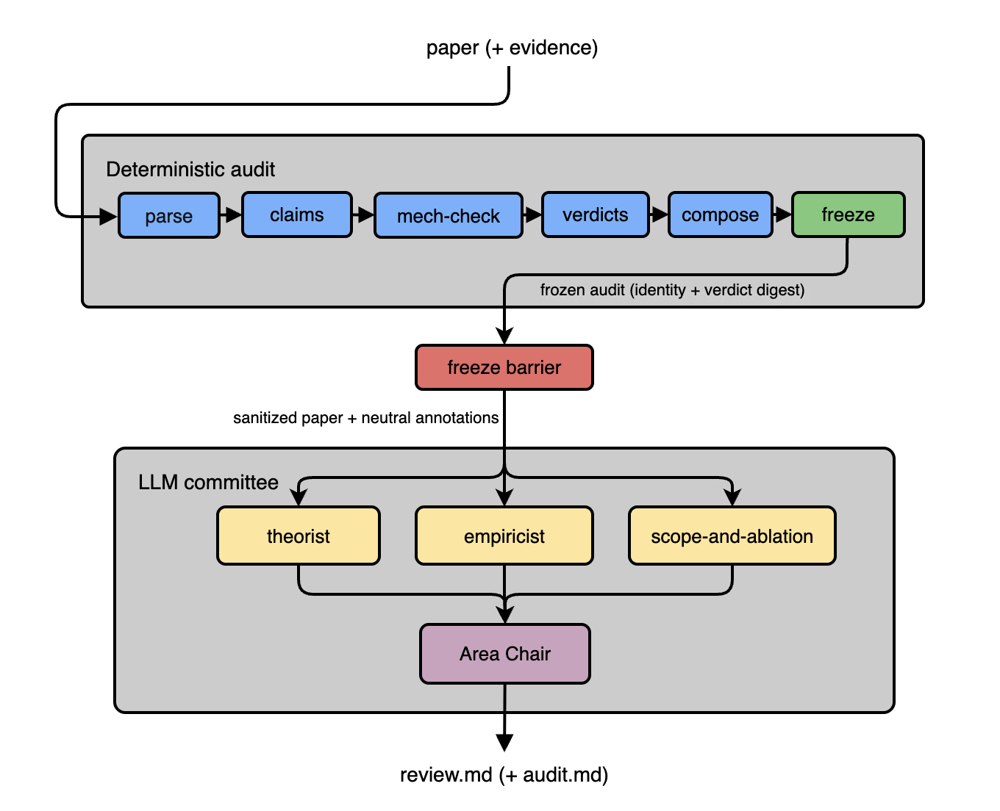

<p align="center">
  
</p>

<h1 align="center">
  🏆 1st Place · Track 2 (Review Agent) — <a href="https://luma.com/hjuo7auc?tk=kAFE8k">Ralphthon @ ICML 2026 Auto-Research</a> — won $10,000 OpenAI credits
</h1>

<h1 align="center">MAC n CHEESE</h1>

<h3 align="center">
  <em>Multi-Agent Committee 'n Checking &amp; Evaluating with Scientific Evidence</em>
</h3>

---

<h4 align="center">
  An evidence-bound, ICML-style reviewer for scientific papers.
</h4>

Give it a paper as a **PDF or Markdown** file — optionally with an evidence
bundle of result files — and it emits a structured ICML-style review whose every
score and claim is traceable to the paper text, its tables, or the supplied
results.

## The idea

LLM reviewers are easy to fool and hard to trust, so the system is split in two:

- A **deterministic core** does the trustworthy work — reproducible checks
  (arithmetic, ledger-tracing, baseline-fairness, citation existence, injection
  scan) that run offline and resist prompt injection.
- An **LLM committee** — three specialist agents plus an area-chair agent —
  adds scientific judgment on top, but only **after the deterministic audit is
  frozen**. The models can enrich the review; they can never quietly rewrite the
  audit's identity or verdict, nor be steered by instructions hidden in a paper.

## Input

- **A paper** (required) — a `.pdf` or `.md` manuscript. PDFs are converted to
  Markdown automatically.
- **An evidence bundle** (optional) — a directory of result files the paper's
  numbers/tables/claims are checked against: `experiments.jsonl` ledgers,
  CSV/JSON results, logs, appendix. Omit it to review the manuscript on its own;
  the checks that need no ledger still run.

## How it works

<p align="center">
  
</p>

An ordered six-stage pipeline (`reviewer/pipeline.py`): **S1** parse → **S2**
claim extraction → **S3** mechanical checks → **S4** evidence-bound verdicts →
**S5** compose → **S6** freeze (content-addressed identity + verdict digest).
The committee runs **only after S6 is frozen**, so no model output can perturb
the audit identity or its verdict labels.

- **Deterministic checks** (S3, always run) — ledger-trace,
  internal-consistency, arithmetic, baseline-fairness, negative-evidence,
  citation-existence, template-compliance, injection-scan, self-review-audit,
  and scientific positioning (novelty / SOTA-overclaim). Hidden
  reviewer-directed text is sanitized and reported, never obeyed; near-white,
  transparent, and non-rendering PDF text is quarantined before extraction.
  Findings reach the committee as **neutral annotations** — leads to weigh,
  never verdicts.
- **Review committee** (default) — `REVIEWER_PANEL` (default 3) **specialist
  agents** each read the **full sanitized paper** and write a complete ICML
  review with all six scores, running concurrently. They share one rubric and
  differ only in where they look hardest:
  - **theorist** — whether the method actually fits the problem, what
    assumptions are hidden, and whether the claims follow from the arguments
    offered;
  - **empiricist** — baselines, ablations, statistical support, and whether the
    experiments actually match the claims;
  - **scope-and-ablation** — how far the claims travel beyond the tested
    setting, and which design choices are load-bearing but left unablated.

  An **area-chair agent** then synthesizes the final review, checking each panel
  criticism against the paper and dropping anything it cannot ground.
  `REVIEWER_PANEL=1` runs a single reviewer and skips the area-chair agent.
  (`reviewer/judgment_review.py`, `reviewer/model_critique.py`)

- **Guardrails on the committee** — a machine-checked title-echo gate rejects a
  review of the wrong paper; a **proven** integrity breach caps Soundness and
  Overall at 2. Any committee failure falls back, per paper, to the
  deterministic audit; if only the area-chair agent fails, the panel median
  stands in.

Scores: Soundness / Presentation / Significance / Originality (1–4), Overall
recommendation (1–6), Confidence (1–5).

## Outputs

- **`review.md`** — the committee's review, safe for double-blind use. When `--out` is omitted, the
  default is `reviews/<paper-stem>.review.<YYYY-MM-DD>.md`.
- **`*.audit.md`** — the sidecar next to the review: content-addressed paper/derived
  identities, the S1–S6 evidence trace, and every panel member's full review, so
  each step stays traceable.

With `--deterministic` there is no committee: `review.md` is the audit document
itself.

## Quick start

```bash
python3 -m venv .venv && source .venv/bin/activate
pip install -r requirements.txt

# Full review — deterministic audit + LLM committee (needs OPENAI_API_KEY + OPENAI_MODEL).
# --out filename.md is optional
python run_review.py path/to/paper.pdf
python run_review.py path/to/paper.pdf --out review.md
```

Copy `.env.example` to `.env` and set `OPENAI_API_KEY` / `OPENAI_MODEL` for the
committee.

Different Options:

```bash
# Many papers at once (one process per paper):
python review_batch.py papers/ --out-dir reviews/ --evidence-root evidence/

# With an evidence directory (optional second argument):
python run_review.py path/to/paper.pdf path/to/evidence_dir

# Offline deterministic check only (no LLM agent reviews):
python run_review.py path/to/paper.pdf --deterministic
```

## Fresh random-PDF smoke and replay

Stress-test the full PDF path on fresh public arXiv papers. The first command
prints a random 64-bit seed, writes a manifest before reviewing, and isolates
failures per paper; replay re-runs a manifest and rejects any PDF whose SHA-256
differs from it.

```bash
python eval/random_pdf_smoke.py --count 5
python eval/random_pdf_smoke.py --replay path/to/manifest.json
```

## Testing

```bash
python -m unittest discover -s tests -q   # unit + regression suite
python eval/eval.py                        # detection / false-positive / injection-resistance score
```

PDF ingestion requires the optional `pymupdf4llm` dependency (installed via
`requirements.txt`); Markdown input has no extra dependencies.
